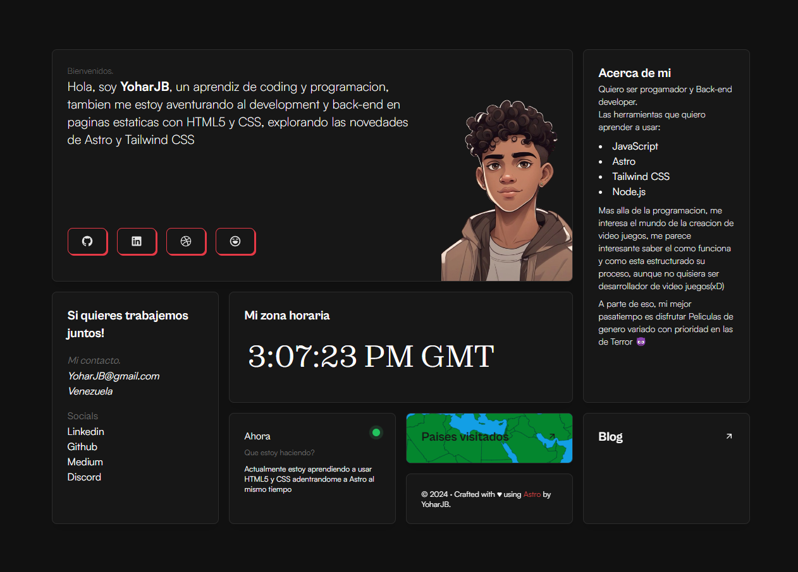

## ⚡️Portafolio creado con Astro.

or my portfolio **[click here](https://yoharjb.github.com/)**

- [Astro](https://astro.build)
- [unocss](https://unocss.dev/)
- [motion](https://motion.dev/)
- [d3](https://d3js.org/)

Deploying your website on Netlify it's optional but I reccomand it in order to deploy it faster and easly.

You just need to fork this repo and linking it to your Netlify account.

or

## Authors

- Gianmarco - https://github.com/Ladvace
